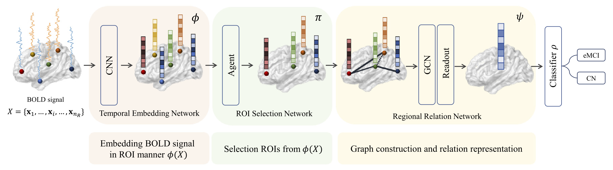

## A unified framework for personalized regions selection and functional relation modeling for early MCI identification
<p align="center"></p>

This repository provides a TensorFlow implementation of the following paper:
> **A unified framework for personalized regions selection and functional relation modeling for early MCI identification**<br>
> Jiyeon Lee<sup>1</sup>\*, [Wonjun Ko](https://scholar.google.com/citations?user=Fvzg1_sAAAAJ&hl=ko&oi=ao)<sup>1</sup>\*, Eunsong Kang<sup>1</sup>, [Heung-Il Suk](https://scholar.google.co.kr/citations?user=dl_oZLwAAAAJ&hl=ko)<sup>1, 2</sup><br/>
> (<sup>1</sup>Department of Brain and Cognitive Engineering, Korea University) <br/>
> (<sup>2</sup>Department of Artificial Intelligence, Korea University) <br/>
> (\*: Equal contribution)
> [[Official version]](https://www.sciencedirect.com/science/article/pii/S1053811921003256)
> Published in NeuroImage
> 
> **Abstract:** *Resting-state functional magnetic resonance imaging (rs-fMRI) has been widely adopted to investigate functional abnormalities in brain diseases. Rs-fMRI data is unsupervised in nature because the psychological and neurologi- cal labels are coarse-grained, and no accurate region-wise label is provided along with the complex co-activities of multiple regions. To the best of our knowledge, most studies regarding univariate group analysis or multivariate pattern recognition for brain disease identification have focused on discovering functional characteristics shared across subjects; however, they have paid less attention to individual properties of neural activities that result from different symptoms or degrees of abnormality. In this work, we propose a novel framework that can iden- tify subjects with early-stage mild cognitive impairment (eMCI) and consider individual variability by learning functional relations from automatically selected regions of interest (ROIs) for each subject concurrently. In par- ticular, we devise a deep neural network composed of a temporal embedding module, an ROI selection module, and a disease-identification module. Notably, the ROI selection module is equipped with a reinforcement learning mechanism so it adaptively selects ROIs to facilitate the learning of discriminative feature representations from a temporally embedded blood-oxygen-level-dependent signals. Furthermore, our method allows us to capture the functional relations of a subject-specific ROI subset through the use of a graph-based neural network. Our method considers individual characteristics for diagnosis, as opposed to most conventional methods that identify the same biomarkers across subjects within a group. Based on the ADNI cohort, we validate the effectiveness of our method by presenting the superior performance of our network in eMCI identification. Furthermore, we provide insightful neuroscientific interpretations by analyzing the regions selected for the eMCI classification.*

## Dependencies
* [Python 3.6+](https://www.continuum.io/downloads)
* [TensorFlow 2.0.0+](https://www.tensorflow.org/)

## Downloading datasets
To download ADNI dataset
* http://adni.loni.usc.edu

## Usage
`network.py` contains the proposed deep learning architectures, `utils.py` contains functions used for experimental procedures, `experiment.py` contains the main experimental functions, and `analysis.py' is used for the analytical results.

## Citation
If you find this work useful for your research, please cite our [paper](https://www.sciencedirect.com/science/article/pii/S1053811921003256):
```
@article{lee2021unified,
  title={A unified framework for personalized regions selection and functional relation modeling for early {MCI} identification},
  author={Lee, Jiyeon and Ko, Wonjun and Kang, Eunsong and Suk, Heung-Il and Alzheimer’s Disease Neuroimaging Initiative and others},
  journal={NeuroImage},
  volume={236},
  pages={118048},
  year={2021},
  publisher={Elsevier}
}
```

## Acknowledgements
This work was supported by National Research Foundation of Korea (NRF) grant funded by the Korea government (MSIT) (No. 2019R1A2C1006543) and partially by Institute of Information & com- munications Technology Planning & Evaluation (IITP) grant funded by the Korea government (MSIT) (No. 2019-0-00079, Artificial Intelligence Graduate School Program (Korea University)).
